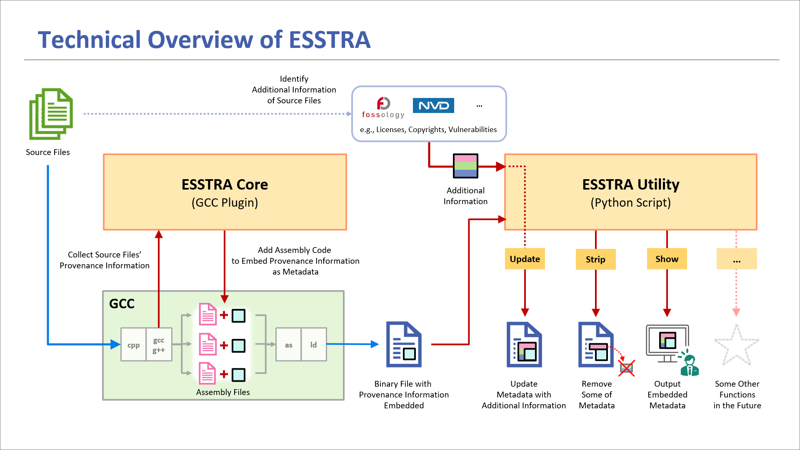

# Project ESSTRA

The Project "ESSTRA", a software suite for
**E**nhancing **S**oftware **S**upply Chain **Tra**nsparency,
aims to improve transparency of software supply chains as the name suggests.

More specifically, the goal of this project is to provide a set of tools to
help illuminate and unveil the "dark" areas in software supply chains where
critical information about software components is unclear, primarily from a
software traceability and compliance perspective.

The current version of ESSTRA takes an approach of embedding metadata in
resulting binary files at compile time with GCC.
The metadata contains information about paths of the source and header
files from which the binary file was generated.

## Status of This Version

ESSTRA is being developed on Ubuntu 22.04 with GCC 11.4.0 and Python
3.10.12 installed on an x86\_64 PC.
And we have also confirmed that ESSTRA can build and run on an Aarch64 (arm64) Docker
container virtualized with QEMU on an x86\_64 PC.

This is a preliminary version. The data format and content of metadata, and the
specifications and functionality of the tools are tentative and subject to
change.

## ESSTRA's Components

The current version of ESSTRA consists of the two tools:

* [ESSTRA Core](./core/README.md)
* [ESSTRA Utility](./util/README.md)

ESSTRA Core (`esstracore.so`) is a
[GCC plugin](https://gcc.gnu.org/wiki/plugins) that intervenes in compilation of
GCC and embeds metadata into the resulting binary file.
In this version, a list of the absolute paths of all source and header
files involved in compilation is embedded in the binary file as metadata.

ESSTRA Utility (`esstra.py`) is a Python script for accessing metadata
in binary files embedded by ESSTRA Core.
In this version, it has only a feature to display contents of metadata embedded
in binary files.

## Technical Overview

ESSTRA Core creates a section in the resulting ELF file to store metadata during compilation.

ESSTRA Utility allows users to access the metadata. For example, you may update the metadata using license information detected from the source files, delete some or all of the metadata, output the metadata to the console or pass it to some other SCA (Software Composition Analysis) tools.



## How to Build and Install

Before you build the GCC plugin, you have to install a package on your system.
For Debian/Ubuntu, check the version of GCC first:

```sh
$ gcc --version
gcc (Ubuntu 11.4.0-1ubuntu1~22.04) 11.4.0
...
```

In this case, the major version is 11, so install the package named
`gcc-11-plugin-dev`:

```sh
$ sudo apt install gcc-11-plugin-dev
```

After that, run `make` in the top directory:

```sh
$ make
```

If no errors, the build is complete.

To install ESSTRA Core and ESSTRA Utility on your system, run the following command:

```sh
$ sudo make install
```

Then `esstracore.so` and `esstra.py` are installed in `/usr/local/share/esstra/`
and `/usr/local/bin/`, respectively.

## How to Use

The workflow using ESSTRA is as follows:

1. Compile source files with GCC using ESSTRA Core
2. Use ESSTRA Utility to access metadata embedded in binary files

The example below compiles the source file `helloworld.c` with `gcc` and
generates the binary file `helloworld`.

First, compile the source file `helloworld.c` by passing the path of
`esstracore.so` to the compiler with the option `-fplugin=`:

```sh
$ gcc -fplugin=/usr/local/share/esstra/esstracore.so helloworld.c -o helloworld
```

Then the intervention of `esstracore.so` embeds metadata in the resulting
binary file `helloworld`. Note that this does not affect the behavior of the
binary file itself.

To access the embedded metadata, use the script `esstra.py`.  The first argument
of this script is a *command*, and the second or subsequent arguments are the
arguments of *command*.

The supported command in this version is `show`, which displays
metadata in binary files passed as the second and subsequent arguments
in YAML format.

A command line:

```sh
$ esstra.py show helloworld
```

would generate an output as follows:

```yaml
#
# BinaryFileName: helloworld
# BinaryPath: /home/snagao/esstra-test/helloworld
#
---
- InputFileName: helloworld.c
  SourceFiles:
  - SourcePath: /home/snagao/esstra-test/helloworld.c
  - SourcePath: /usr/include/stdc-predef.h
  - SourcePath: /usr/include/stdio.h
  - SourcePath: /usr/include/x86_64-linux-gnu/bits/libc-header-start.h
  - SourcePath: /usr/include/features.h
  - SourcePath: /usr/include/features-time64.h
  - SourcePath: /usr/include/x86_64-linux-gnu/bits/wordsize.h
  - SourcePath: /usr/include/x86_64-linux-gnu/bits/timesize.h
  - SourcePath: /usr/include/x86_64-linux-gnu/sys/cdefs.h
  - SourcePath: /usr/include/x86_64-linux-gnu/bits/long-double.h
  - SourcePath: /usr/include/x86_64-linux-gnu/gnu/stubs.h
  - SourcePath: /usr/include/x86_64-linux-gnu/gnu/stubs-64.h
  - SourcePath: /usr/lib/gcc/x86_64-linux-gnu/11/include/stddef.h
  - SourcePath: /usr/lib/gcc/x86_64-linux-gnu/11/include/stdarg.h
  - SourcePath: /usr/include/x86_64-linux-gnu/bits/types.h
  - SourcePath: /usr/include/x86_64-linux-gnu/bits/typesizes.h
  - SourcePath: /usr/include/x86_64-linux-gnu/bits/time64.h
  - SourcePath: /usr/include/x86_64-linux-gnu/bits/types/__fpos_t.h
  - SourcePath: /usr/include/x86_64-linux-gnu/bits/types/__mbstate_t.h
  - SourcePath: /usr/include/x86_64-linux-gnu/bits/types/__fpos64_t.h
  - SourcePath: /usr/include/x86_64-linux-gnu/bits/types/__FILE.h
  - SourcePath: /usr/include/x86_64-linux-gnu/bits/types/FILE.h
  - SourcePath: /usr/include/x86_64-linux-gnu/bits/types/struct_FILE.h
  - SourcePath: /usr/include/x86_64-linux-gnu/bits/stdio_lim.h
  - SourcePath: /usr/include/x86_64-linux-gnu/bits/floatn.h
  - SourcePath: /usr/include/x86_64-linux-gnu/bits/floatn-common.h
```

## License

See the [LICENSE](./LICENSE) file.
