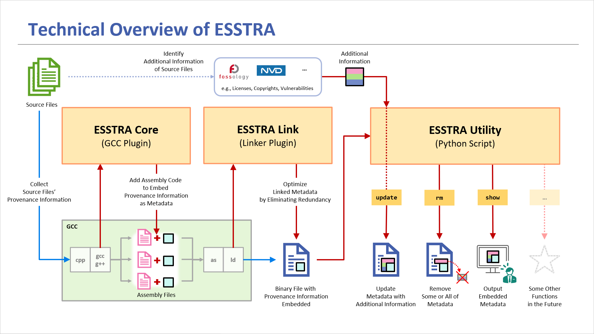

# Project ESSTRA

Project "ESSTRA", a software suite for
**E**nhancing **S**oftware **S**upply Chain **Tra**nsparency,
aims to improve the transparency of software supply chains as the name suggests.

More specifically, the goal of this project is to provide a set of tools to
help illuminate and unveil the "dark" areas in software supply chains where
critical information about software components is unclear, primarily from
software traceability and compliance perspective.

The current version of ESSTRA takes an approach of embedding metadata in
resulting binary files at compile time with GCC.
The metadata contains information about the source and header files from which
the binary file is generated.

For detailed usage and applications, please refer to the
[Samples](./samples/) that help you understand ESSTRA using simple
source code, as well as the [Case Study documentation](./doc/case-study) on
using ESSTRA for open-source software and Linux distributions.

## Status of This Version

ESSTRA is being developed on Ubuntu 22.04 with GCC 11.4.0 and Python
3.10.12 installed on an x86\_64 PC.
We have also confirmed that ESSTRA can be built and run on an Aarch64 (arm64)
Docker container virtualized with QEMU on an x86\_64 PC.

This is a preliminary version. The data format and content of the metadata,
as well as the specifications and functionality of the tools are tentative
and subject to change.

## ESSTRA's Components

The current version of ESSTRA consists of two tools:

* [ESSTRA Core](./core)
* [ESSTRA Utility](./util)

The ESSTRA Core (`esstracore.so`) is a
[GCC plugin](https://gcc.gnu.org/wiki/plugins) that intervenes in compilation
process of GCC and embeds metadata into the resulting binary file.
In this version, a list of the absolute paths of all source and header
files involved in compilation is embedded in the binary file as metadata.

The ESSTRA Utility (`esstra.py`) is a Python script for accessing metadata in
binary files embedded by the ESSTRA Core.

In this version, you can output metadata in YAML format, shrink metadata by
removing duplication, and attach license information to metadata by specifying
files in the
[SPDX 2.3 tag-value format](https://spdx.github.io/spdx-spec/v2.3/)
which contain license information.

## Technical Overview

The ESSTRA Core creates a section in the resulting ELF file to store metadata
during compilation.

The ESSTRA Utility allows users to access the metadata. For example, you can
update the metadata using license information detected from the source files,
delete some or all of the metadata, output the metadata to the console, or
pass it to other SCA (Software Composition Analysis) tools.



## How to Build and Install

Before building the GCC plugin, you need to install a package on your system.
For Debian/Ubuntu, first check the version of GCC:

```sh
$ gcc --version
gcc (Ubuntu 11.4.0-1ubuntu1~22.04) 11.4.0
...
```

In this case, the major version is 11, so install the package named
`gcc-11-plugin-dev`:

```sh
$ sudo apt install gcc-11-plugin-dev
```

Since the [ESSTRA Utility](./util) uses the [PyYAML](https://pyyaml.org/)
module to handle YAML data, you may need to install it by typing:

```sh
$ pip install pyyaml
or
$ sudo apt install python3-yaml
```

After that, run `make` in the top directory:

```sh
$ make
```

If there are no errors, the build is complete.

To install the ESSTRA Core and the ESSTRA Utility on your system, run the
following command:

```sh
$ sudo make install
```

Then the files `esstracore.so` and `esstra.py` will be installed in the directory
`/usr/local/lib/gcc/<gcc-arch>/<gcc-major-version>/plugin/` and `/usr/local/bin/`,
respectively.

## How to Use

The workflow using ESSTRA is as follows:

1. Compile source files with GCC using the ESSTRA Core
2. Use the ESSTRA Utility to access metadata embedded in the binary files

The example below compiles a source file
`hello.c` with `gcc` and generates a binary file `hello`.
(See also [Sample "hello"](./samples/hello/))

First, compile the source file `hello.c` by passing the path of
`esstracore.so` to the compiler with the `-fplugin` option.
Since we are using GCC version 11 on an x86\_64 PC, the command line would be as follows:

```sh
$ gcc -fplugin=/usr/local/lib/gcc/x86_64-linux-gnu/11/plugin/esstracore.so hello.c -o hello
```

The intervention of `esstracore.so` embeds metadata in the resulting
binary file `hello`. Note that this does not affect the behavior of the
binary file itself.

To access the embedded metadata, use the script `esstra.py`. The first argument
of this script is a *command*, and the second or subsequent arguments are the
arguments of the *command*.

The command `show` displays metadata in binary files in YAML format.
A command line:

```sh
$ esstra.py show hello
```

would generate an output as follows:

```yaml
#
# BinaryFileName: hello
# BinaryPath: /home/snagao/esstra/samples/hello/hello
#
Headers:
  ToolName: ESSTRA Core
  ToolVersion: 0.2.0
  DataFormatVersion: 0.1.0
  InputFileNames:
  - hello.c
SourceFiles:
- Directory: /home/snagao/esstra/samples/hello
  Files:
  - File: hello.c
    SHA1: 4bbee85215cbcb6a4f1625e4851cca19b0d3f6e2
- Directory: /usr/include
  Files:
  - File: features-time64.h
    SHA1: 57c3c8093c3af70e5851f6d498600e2f6e24fdeb
  - File: features.h
    SHA1: d8725bb98129d6d70ddcbf010021c2841db783f7
  - File: stdc-predef.h
    SHA1: 2fef05d80514ca0be77efec90bda051cf87d771f
  - File: stdio.h
    SHA1: c7181b48c4194cd122024971527aab4056baf600
- Directory: /usr/include/x86_64-linux-gnu/bits
  Files:
  - File: typesizes.h
    SHA1: ee94b5a60d007c23bdda9e5c46c8ba40f4eb402c
  - File: wordsize.h
    SHA1: 281ddd3c93f1e8653e809a45b606574c9b691092
- Directory: /usr/include/x86_64-linux-gnu/bits/types
  Files:
  - File: FILE.h
    SHA1: 497924e329d53517631713ae52acb73e870d7d65
  - File: __FILE.h
    SHA1: 274242343e85d1c06e7f5ccc5abf15e120f6e957
  - File: __fpos64_t.h
    SHA1: ac38e294b004f6e2bf18f1c55e03dc80f48d6830
  - File: __fpos_t.h
    SHA1: 760ef77769ac1921f4b1f908cbf06863e2506775
  - File: __mbstate_t.h
    SHA1: e3a4f2ee55e635520db0b4610d2b361e9ce41de7
  - File: struct_FILE.h
    SHA1: 1dbf8bac589cb09e09aa4c1d36913e549a57bcf0
- Directory: /usr/include/x86_64-linux-gnu/gnu
  Files:
  - File: stubs-64.h
    SHA1: f7603fa3908b56e9d1b33c91590db3252e13a799
  - File: stubs.h
    SHA1: be168037b7503a82b1cf694cdbac8c063bb6e476
- Directory: /usr/include/x86_64-linux-gnu/sys
  Files:
  - File: cdefs.h
    SHA1: a419a6372029d89ba38ada0811d34f51df8d09b7
- Directory: /usr/lib/gcc/x86_64-linux-gnu/11/include
  Files:
  - File: stdarg.h
    SHA1: fa23f49da8a0a5068b781dff7182f1a1c363dc30
  - File: stddef.h
    SHA1: 0de70008ffa3f198baf55c7b3f3d03b4ca11c21f
```

For more details, refer to the file [util/README.md](/util/README.md).

### Installing Spec File

It can be quite annoying to specify `-fplugin=....` for every `gcc`/`g++`
invocation.
To avoid this tedious task, simply type:

```sh
$ sudo make install-specs
```

This command installs a
[GCC spec file](https://gcc.gnu.org/onlinedocs/gcc/Spec-Files.html)
on your system which enables the option:

* `-fplugin=/usr/local/lib/gcc/<gcc-arch>/<gcc-major-version>/plugin/esstracore.so`

by default.

After that, compiling anything with GCC as usual:

```sh
$ gcc hello.c -o hello
```

will generate a binary file with metadata embedded by the ESSTRA Core.

This is a very useful feature when you compile open-source or closed-source
projects and want the information the ESSTRA Core generates for them.

For more details about installing/uninstalling the spec file,
refer to the file [core/README.md](./core/README.md).

## How to uninstall

To uninstall the ESSTRA Core, the ESSTRA Utility, and spec file from your system, run the
following command in the top directory :

```sh
$ sudo make uninstall
```

## License

See the [LICENSE](./LICENSE) file.
