# License Analysis Using FOSSology

This document explains how to generate a license information file in the
[SPDX 2.3 tag-value format](https://spdx.github.io/spdx-spec/v2.3/)
using the open-source software license analysis tool
[FOSSology](https://github.com/fossology/fossology).

Specifically, it details the analysis of the
[entire ESSTRA repository](https://github.com/sony/esstra)
with FOSSology, resulting in the generation of an SPDX 2.3 tag-value format file,
[`SPDX2TV_esstra.spdx`](../output-examples/SPDX2TV_esstra.spdx).

By providing this file to the
[ESSTRA Utility](/util/README.md),
you can associate license information with each file's information in the
metadata embedded in the binary.

## Starting the FOSSology Server

We will use the FOSSology container image provided on
[Docker Hub](https://hub.docker.com/).
Pull the FOSSology container image with the following command:

```sh
$ docker pull fossology/fossology
```

Once successful, start the FOSSology server with the following command:

```sh
$ docker run -p 8081:80 fossology/fossology
```

This will allow you to access the FOSSology server via port 8081 on the
host. Open a web browser and go to:

* `http://<host_ip_addr>:8081/repo`

When accessing FOSSology, you need to append `/repo` to the URL.

Then the FOSSology startup screen will appear in your browser. Enter `fossy` for
both "Username:" and "Password:" to log in.

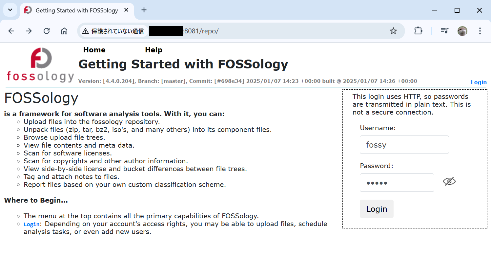

## Analyzing Source Code with FOSSology

The reason for explaining how to use FOSSology in this document is to identify
the licenses of some files included in the samples. However, for simplicity, we
will scan the entire [ESSTRA GitHub repository](https://github.com/sony/esstra)
and generate a single license information file that can be used for all samples.

First, click on the "Upload" menu at the top of the screen and select "From
Version Control System".

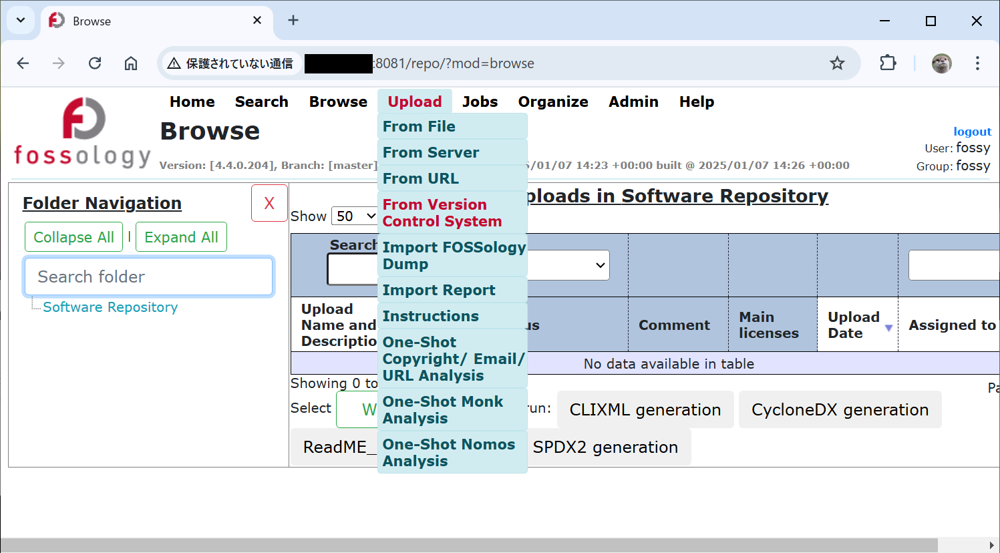

You will be taken to a screen titled "Upload from Version Control System".
Then enter:

* "https://github.com/sony/esstra".

in the field "3. Enter the URL of the repo:".

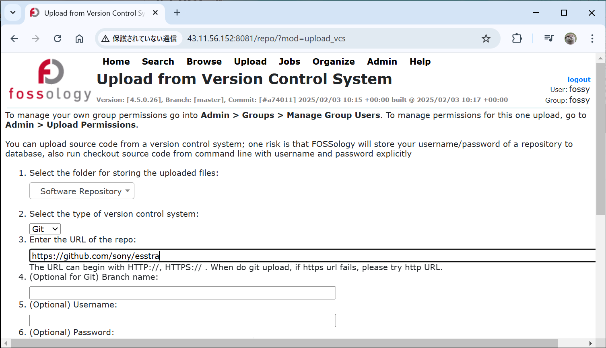

Scroll down the page and check at least the following items listed under
"11. Select optional analysis:", then click the "Upload" button at the bottom
of the page:

* Monk License Analysis
* Nomos License Analysis
* Ojo License Analysis

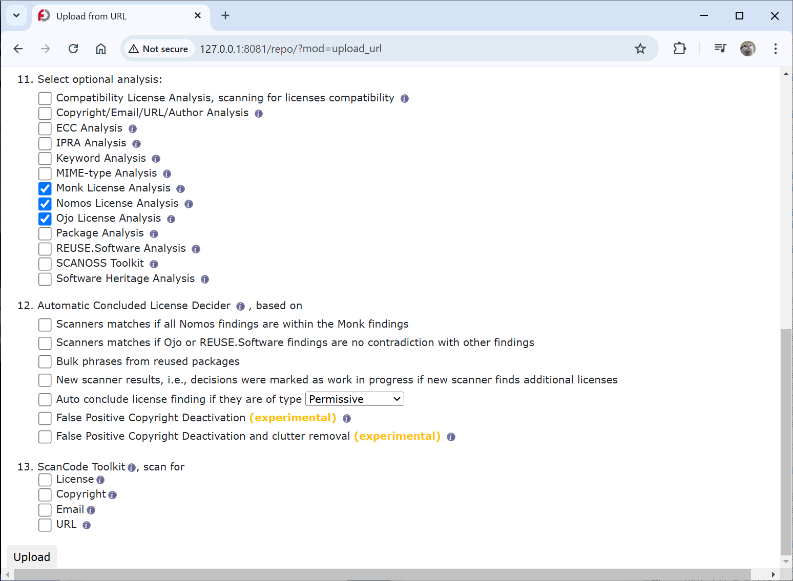

The page will reload, and you should see a message just below the logo at the
top of the screen saying:

* The file esstra has been uploaded. It is upload #x.

Then, click on the "Jobs" menu at the top of the screen and select "All Recent Jobs".

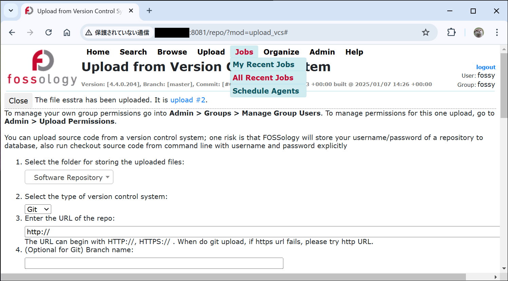

A list of jobs running within the FOSSology system will be displayed. Wait
until all the jobs are "Completed".

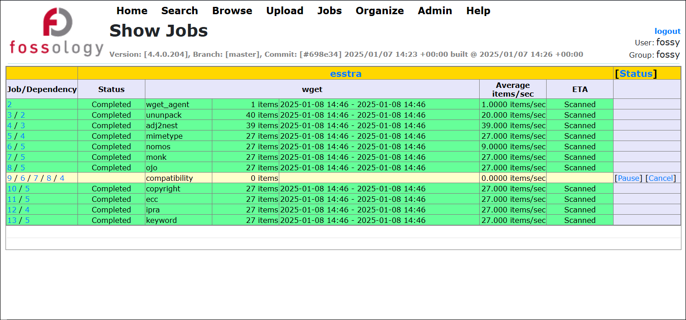

Next, click on the "Browse" menu at the top of the screen. A list of source
codes loaded into FOSSology will be displayed. Confirm that an item named
"esstra" appears and click on it.

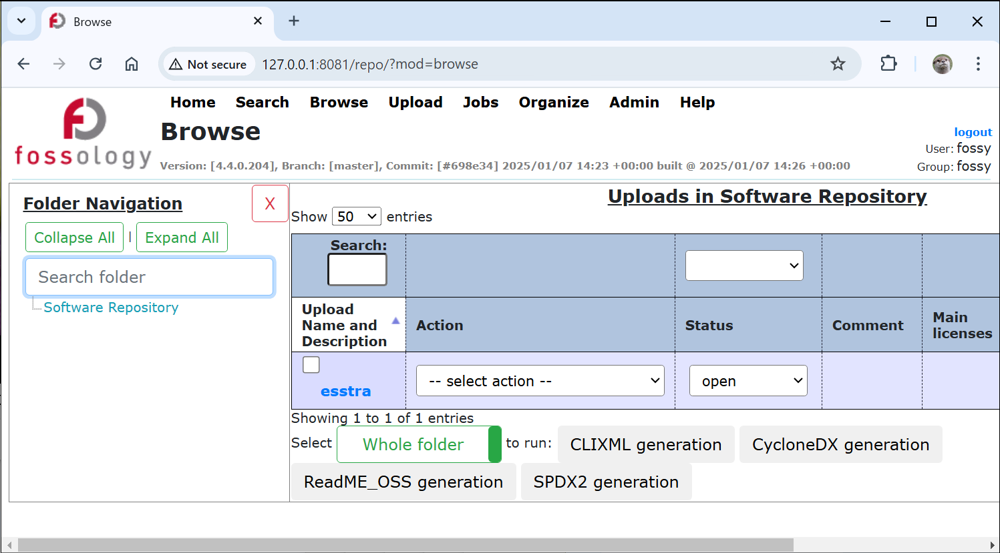

You will be taken to a page titled "License Browser". On this screen, you can
see the results of the license scan for all files in the
[ESSTRA repository](https://github.com/sony/esstra).

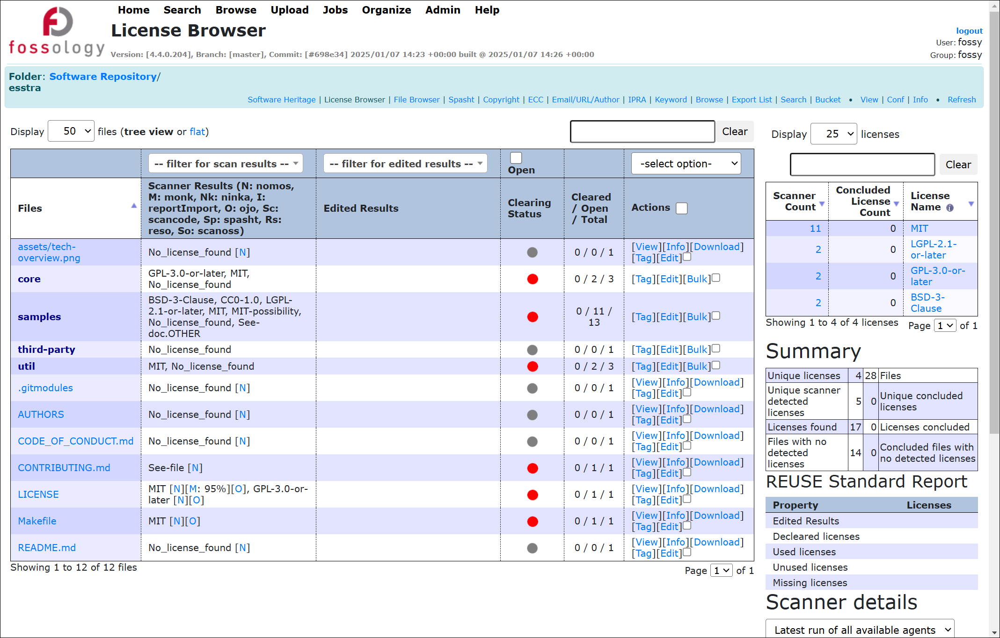

For example, in the [Sample "hello"](./README.md), we assume that `hello.c` is
under the MIT license. To verify that this is recognized as intended, click
through `samples` > `hello` > `hello.c`.

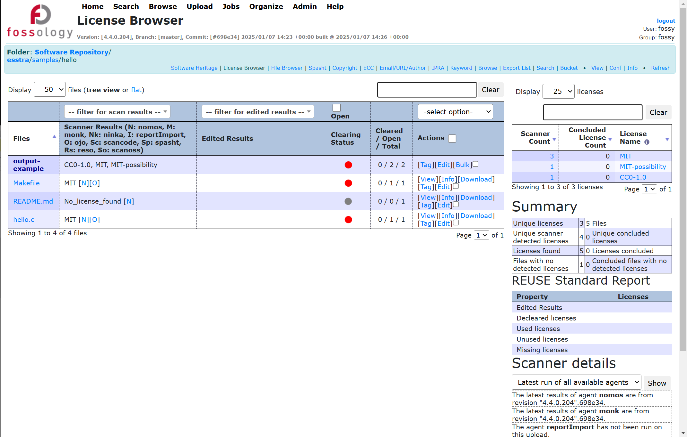

Finally, you will be taken to a screen displaying the contents of
`hello.c`. Check the "License" section in the table at the bottom right.

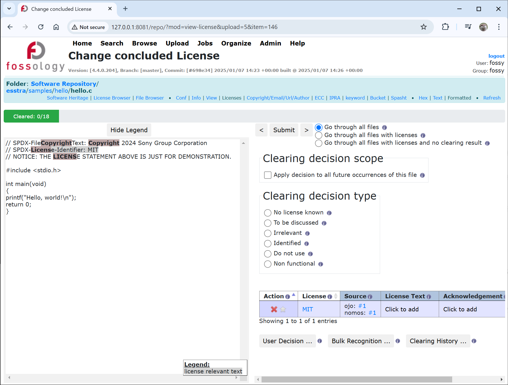

Since it shows "MIT", we can confirm that FOSSology has correctly recognized
the license of `hello.c` as "MIT License".

## Downloading FOSSology Scan Results

Click on the "Browse" menu at the top of the screen to navigate to the page
displaying the list of source codes loaded into FOSSology.

Click on "-- select action --" to the right of "esstra" to reveal a dropdown
list, then select "Export SPDX tag:value report". This will download the scan
results for all files in the
[ESSTRA repository](https://github.com/sony/esstra)
as an SPDX tag-value format file named
[`SPDX2TV_esstra.spdx`](../output-examples/SPDX2TV_esstra.spdx).

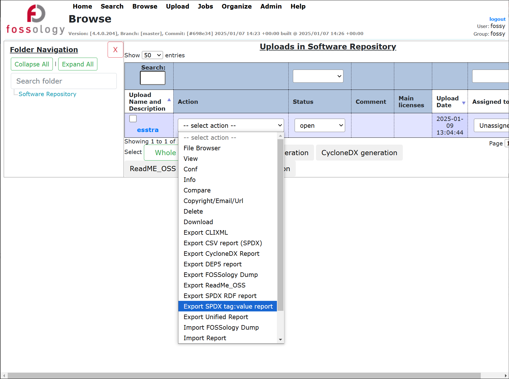

Below is a portion of the downloaded file `SPDX2TV_esstra.spdx`:

```yaml
SPDXVersion: SPDX-2.3
DataLicense: CC0-1.0

##-------------------------
## Document Information
##-------------------------

DocumentNamespace: http://789bc35d6e0e/repo/SPDX2TV_esstra.spdx
DocumentName: /srv/fossology/repository/report
SPDXID: SPDXRef-DOCUMENT

   :

##--------------------------
## File Information
##--------------------------

   :

##File

FileName: esstra/samples/hello/hello.c
SPDXID: SPDXRef-item146
FileChecksum: SHA1: e7834d0b9cb6cb116c72f0bee7da29e3d280b27e
FileChecksum: SHA256: 8134eae34d2a46ffdaedc04628427282d3d73ae47affd33463111efc89fa5a96
FileChecksum: MD5: b5ca38edd7197004cfb8290d0ca0e87d
LicenseConcluded: NOASSERTION

LicenseInfoInFile: MIT
FileCopyrightText: NOASSERTION

   :

```

This file contains various pieces of information, however, you can see that the
information of the file `hello.c` includes a line `LicenseInfoInFile: MIT`.

## Summary

This document has demonstrated how to analyze the entire repository using the
license analysis tool
[FOSSOlogy](https://github.com/fossology/fossology)
and generate a file in the SPDX 2.3 tag-value format as a result, named
[`SPDX2TV_esstra.spdx`](../output-examples/SPDX2TV_esstra.spdx).

In the [Sample "hello"](./README.md) and the [Sample
"hello2"](../hello2/README.md), we explain the steps to use this file to
associate license information with the metadata embedded in the binary.
